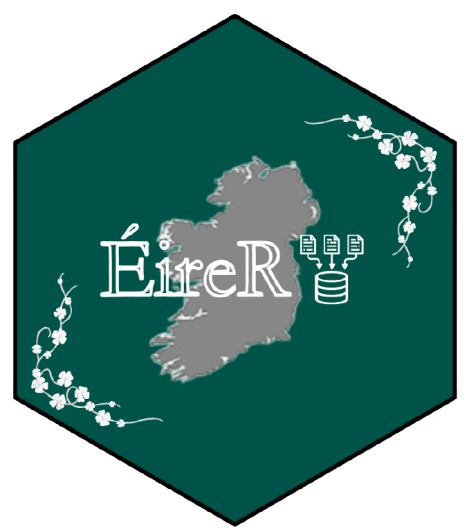
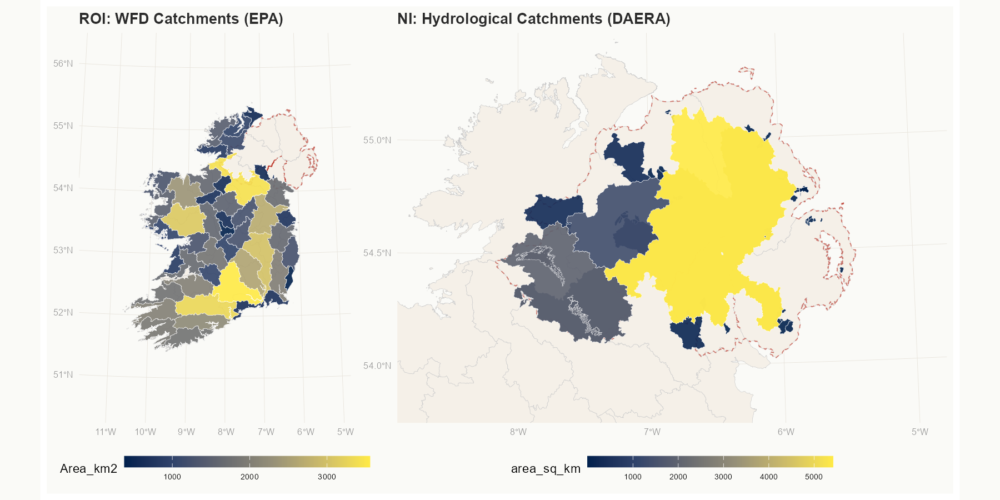

# EireR 

[](https://cran.r-project.org/) [](https://opensource.org/licenses/MIT) [](https://creativecommons.org/licenses/by/4.0/)

## Overview

Conducting geospatial analysis across the island of Ireland presents a persistent challenge for researchers, ecologists, planners, and data scientists. Although the island of Ireland functions as a single geographic system, it is served by two separate governmental jurisdictions, each maintaining its own spatial data infrastructure, data portals, coordinate reference systems, and dataset standards. As a result, accessing and integrating geospatial data for all-island analyses can be time-consuming, often requiring users to navigate multiple data providers, reconcile differing naming conventions, and harmonise datasets before analysis can begin.

**EireR was created to simplify this process.**

Named after the Irish word **Éire** (used in *Gaeilge* to refer to the island of Ireland and derived from the Old Irish word **Ériu**), EireR reflects the package's central aim: providing seamless access to geospatial data for the entire island rather than within a single jurisdiction.

EireR is a streamlined gateway to Irish geospatial data. The package provides a consistent interface for discovering, downloading, and harmonising openly licensed datasets from across both the Republic of Ireland and Northern Ireland.

By bringing data from multiple providers together within a single workflow, EireR removes the need to navigate multiple portals, reconcile incompatible formats, and manually integrate datasets from different jurisdictions. This is particularly valuable for all-island analyses, where data frequently cross administrative boundaries and institutional data systems. The result is fast, reproducible, and harmonised access to Irish geospatial data directly within R, allowing users to move seamlessly from data discovery to analysis.

The package streamlines the entire data pipeline from discovery to download:

-   **Find** — browse 1,023 datasets across 12 themes using `eire_catalogue()`
-   **Get** — download any dataset with a single function call, already reprojected to ITM
-   **Plot** — visualise instantly with `plot_eire()`, no CRS conversion needed.

A secondary but equally important goal of EireR is to enable **cross-jurisdictional comparison**. While the differing data standards of separate geospatial providers mean that directly equivalent datasets are not always available on both sides of the border, EireR makes it straightforward to access, compare, and visualise analogous datasets side by side - something that previously required substantial manual effort across multiple platforms.

------------------------------------------------------------------------

## Installation

``` r
# Step 1: Install devtools if you don't already have it
install.packages("devtools")
 
# Step 2: Install EireR from GitHub
devtools::install_github("Aoibhinmurphy/EireR")
 
# Step 3: Load the package
library(EireR)

# Step 4: Load 'patchwork' package for side-by-side plotting
library(patchwork)
```

------------------------------------------------------------------------

## Workflow

### 1. Browse the data registry

EireR ships with a catalogue of **1,023 geospatial datasets** auto-discovered from four open source APIs.

Start by exploring what is available:

``` r
# See everything
eire_catalogue()

# Open in spreadsheet viewer
View(eire_catalogue())
```

*EXAMPLE: A random sample from the 1,023 dataset `View(eire_catalogue())` registry (limited to: 6 col x 6 rows).*

| `eiredataset_id` | name | jurisdiction | theme | service_type | licence |
|------------|------------|------------|------------|------------|------------|
| `ckan_translink_bus_rail_stations` | Translink Bus & Rail Stations | NI | transport | CKAN | OGL v3 |
| `hub_sdg_15_1_2_proportion_of_important_sites...` | SDG 15.1.2 Biodiversity Protected Areas | ROI | boundary | ArcGIS REST | CC BY 4.0 |
| `hub_local_infrastructure_housing_activation_fund_lihaf` | Local Infrastructure Housing Activation Fund | ROI | other | ArcGIS REST | CC BY 4.0 |
| `epa_wfd_groundwaterbodiesactive` | WFD Groundwater Bodies Active | ROI | hydrology | WFS | CC BY 4.0 |
| `epa_hydro_catchments` | Hydro Catchments | ROI | hydrology | WFS | CC BY 4.0 |
| `ckan_cemeteries_and_old_graveyards_in_causeway_coast` | Cemeteries and Old Graveyards | NI | marine | CKAN | OGL v3 |
| `ckan_1983_os_27_10k` | 1983 OS 1:10k Map | NI | other | CKAN | OGL v3 |
| `ckan_agglomeration_roads_lday` | Agglomeration Roads (Noise) | NI | transport | CKAN | OGL v3 |

### 2. Use filters to narrow your search

``` r

# Filter by jurisdiction
eire_catalogue(jurisdiction = "ROI")
eire_catalogue(jurisdiction = "NI")
 
# Filter by theme
eire_catalogue(theme = "hydrology")
eire_catalogue(theme = "boundary")
eire_catalogue(theme = "environment")
 
# Search by keyword
eire_catalogue(search = "catchment")
eire_catalogue(search = "coastal")
 
# Combine filters
eire_catalogue(jurisdiction = "NI", theme = "marine")
 
```

Available themes: `boundary`, `hydrology`, `population`, `environment`, `land_cover`, `elevation`, `transport`, `marine`, `geology`, `recreation`, `placenames`, `other`

### 3. Download what you need

Once you know what you are looking for, download it directly.

-   Do you know your dataset ID? Use `get_layer()`.

-   Need boundaries? Use `get_counties()` or `get_districts()`.

``` r
# All 32 counties — both jurisdictions, harmonised, in ITM
counties  <- get_counties()
districts <- get_districts()
 
# A specific layer by dataset ID
catchments_roi <- get_layer("epa_wfd_catchments")
catchments_ni  <- get_layer("hub_dwpa_abstraction_point_hydrological_catchments")
hso_rivers     <- get_layer("epa_highstatusobjective_rivers")
coastal_roi    <- get_layer("epa_highstatusobjective_coastal")
coastal_ni     <- get_layer("ckan_ni_coastal_erosion_high_level_risk_appraisal")
```

Everything is automatically:

-   Reprojected to **ITM (EPSG:2157)**

-   Returned as a standard **`sf` object**

### 4. Plot instantly

``` r
# Auto-zooms to the data extent (either whole island or NI)
plot_eire(counties, fill_by = jurisdiction)
plot_eire(counties, fill_by = area_km2, title = "County areas (km2)")
plot_eire(hso_rivers, fill_by = ECO_Status,
          title = "High Ecological Status Rivers - ROI")
 
# Side by side with patchwork
library(patchwork)
p1 <- plot_eire(catchments_roi, fill_by = Area_km2,
                title = "ROI: WFD Catchments (EPA)")
p2 <- plot_eire(catchments_ni, fill_by = area_sq_km,
                title = "NI: Hydrological Catchments (DAERA)")
p1 + p2
```

------------------------------------------------------------------------

## Example: Cross-Jurisdictional Catchment Comparison

One of the most compelling use cases for EireR is comparing corresponding datasets from both jurisdictions side by side. While direct dataset equivalents are not always available, a natural consequence of separate data providers operating under different methodologies, it is still valuable to visualize spatial information across the island as a whole. EireR makes it straightforward to access and compare the closest available datasets from each jurisdiction.

The example below compares WFD catchment boundaries from the EPA (ROI) with hydrological catchment areas from DAERA (NI), both coloured by catchment area in km². The datasets come from different providers, use different schemas and variables, and were published independently, but EireR retrieves both with identical function calls and delivers them in the same coordinate reference system, ready for immediate visual comparison or for further anaylsis.

``` r
library(EireR)
library(patchwork)
 
# ROI catchments from EPA GeoServer (WFS)
catchments_roi <- get_layer("epa_wfd_catchments")

# NI catchments from DAERA ArcGIS Hub
catchments_ni  <- get_layer("hub_dwpa_abstraction_point_hydrological_catchments")

# Plot side by side — same metric, same CRS, different providers
p1 <- plot_eire(catchments_roi, fill_by = Area_km2, palette = "E",
                title = "ROI: WFD Catchments (EPA)")
p2 <- plot_eire(catchments_ni, fill_by = area_sq_km, palette = "E",
                title = "NI: Hydrological Catchments (DAERA)")
p1 + p2
```



> **Note on data comparability:** EireR provides a seamless workflow for accessing and visualising geospatial data from both jurisdictions. Because ROI and NI data are published by separate government agencies with independent standards, directly equivalent datasets are not always available. EireR's value lies in making the best available data from each jurisdiction accessible through a consistent, unified interface, enabling researchers to make informed comparisons where the data allows.

------------------------------------------------------------------------

## More on the Dataset Registry

### Registry fields

Every dataset in the registry contains 17 metadata fields:

| Field           | Description                                |
|-----------------|--------------------------------------------|
| `dataset_id`    | Unique identifier — use with `get_layer()` |
| `name`          | Human-readable dataset name                |
| `jurisdiction`  | `"ROI"` or `"NI"`                          |
| `provider`      | Organisation that publishes the data       |
| `provider_url`  | Provider website                           |
| `download_url`  | Permanent download or API URL              |
| `licence`       | Data licence (CC BY 4.0 or OGL v3)         |
| `licence_url`   | Link to full licence text                  |
| `layer_type`    | `"point"`, `"line"`, or `"polygon"`        |
| `theme`         | Thematic category                          |
| `service_type`  | `"WFS"`, `"ArcGIS REST"`, or `"CKAN"`      |
| `service_url`   | Base API endpoint                          |
| `service_layer` | Layer identifier within the service        |
| `output_format` | Always `"GeoJSON"`                         |
| `crs_original`  | CRS before harmonisation to ITM            |
| `date_acquired` | When the registry entry was created        |
| `last_update`   | When the provider last updated the data    |
| `notes`         | Additional context                         |

### Data sources

| Source | Jurisdiction | Protocol | Datasets | Licence |
|---------------|---------------|---------------|---------------|---------------|
| [EPA GeoServer](https://gis.epa.ie) | ROI | OGC WFS | 275 | CC BY 4.0 |
| [GeoHive / Tailte Éireann](https://www.geohive.ie) | ROI | ArcGIS Hub REST | 312 | CC BY 4.0 |
| [DAERA Open Data Hub](https://www.daera-ni.gov.uk) | NI | ArcGIS Hub REST | 105 | OGL v3 |
| [OpenDataNI](https://www.opendatani.gov.uk) | NI | CKAN API | 426 | OGL v3 |

------------------------------------------------------------------------

## Utilities

``` r
# Cache management — downloads are stored locally after first use
eirer_cache()              # see what is cached
eirer_cache(clear = TRUE)  # clear all cached files
 
# CRS information
eirer_crs()                # returns 2157 (ITM EPSG code)
 
# Reproject your own data to match EireR output
my_data <- sf::st_transform(my_data, eirer_crs())
 
# Pre-built bounding boxes in ITM coordinates
ireland_bbox()             # whole island
ireland_bbox("ROI")        # Republic of Ireland
ireland_bbox("NI")         # Northern Ireland
```

------------------------------------------------------------------------

## Data Attribution

All data accessed through EireR is openly licensed. When using EireR outputs in publications or reports, please credit the original data providers:

-   **EPA Ireland** — [epa.ie](https://www.epa.ie) — CC BY 4.0
-   **Tailte Éireann / OSi** — [geohive.ie](https://www.geohive.ie) — CC BY 4.0
-   **DAERA** — [daera-ni.gov.uk](https://www.daera-ni.gov.uk) — Open Government Licence v3.0
-   **Land & Property Services / OSNI** — [opendatani.gov.uk](https://www.opendatani.gov.uk) — Open Government Licence v3.0

``` r
# Check licence for any dataset
eire_datasets[eire_datasets$dataset_id == "epa_wfd_catchments",
              c("provider", "licence", "licence_url")]
```

------------------------------------------------------------------------

## Package Architecture

```         
EireR
├── R/
│   ├── get_boundaries.R   # get_counties(), get_districts()
│   ├── get_layer.R        # get_layer() — access any of 1,023 datasets
│   ├── plot.R             # plot_eire() — clean map visualisation
│   ├── data.R             # eire_catalogue(), eire_datasets
│   ├── utils_cache.R      # fetch_cached(), eirer_cache()
│   ├── utils_harmonise.R  # CRS harmonisation, name standardisation
│   └── region.R           # region= filtering system
├── data/
│   └── eire_datasets.rda  # 1,023 dataset registry (ships with package)
└── data-raw/
    └── build_registry.R   # Rebuilds registry from live APIs
```

------------------------------------------------------------------------

## Contributing

Contributions welcome! If you find a dataset that should be included or a data source that was missed, please open an issue or pull request at [github.com/Aoibhinmurphy/EireR](https://github.com/Aoibhinmurphy/EireR).

------------------------------------------------------------------------

## References & Resources

-Gerard, D. (2025). *Getting Data Through APIs*. Retrieved from [data-science-master.github.io](https://data-science-master.github.io/lectures/05_web_scraping/05_apis.html)

\- [httr2 documentation](https://httr2.r-lib.org/)

*EireR was developed as part of an academic project at the University of Würzburg.*\
*Built with ❤️ for all-island Ireland research.*